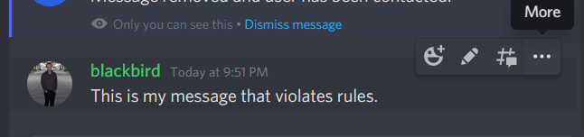
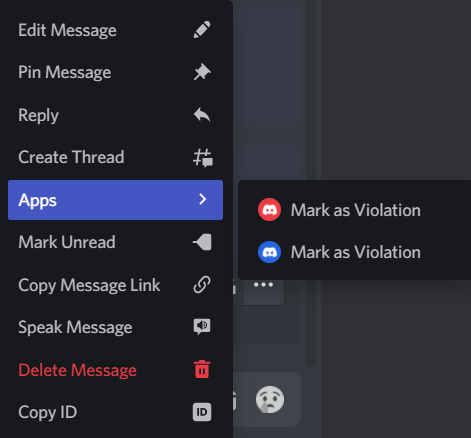
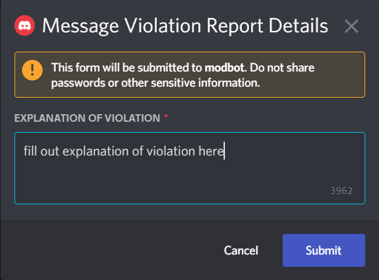
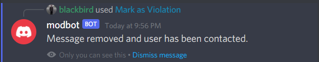
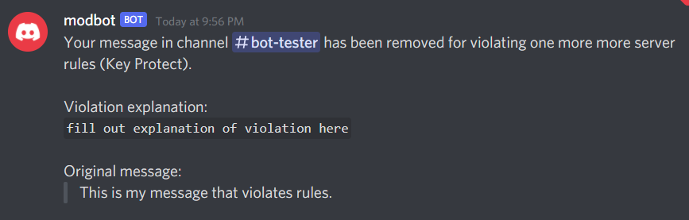

# modbot

`modbot` is a Discord bot built to facilitate easier moderation in your server. This implementation is specifically backed by the Function as a Service (FaaS), AWS Lambda.

## Usage

### Reporting message as a violation

**Via Message Command**

Currently, message commands only works on Desktop
1. Hover over message you want to report as a violation



2. Click `...` to bring up more options and go to `App` and click `Mark as Violation`



_Note: Please ignore the double command. You should only have one options unless you install a staging app._

3. Fill out the explanation of the violation and submit



4. The bot will delete the message in the channel



5. The bot will also DM the user with a notification that their message has been deleted




### Notes
- If you want to use the bot in a private channel, you must add the bot to the channel
    - Right click the channel and click `Channel Settings`
    - Go to `Permissions`
    - Add your bot user and/or your bot role

Adding to your own server
---

## Setup

Prerequisites:
- python3
- docker
- discord account
- discord server

### AWS
#### Required Infrastrucure:
- AWS Elastic Container Registry (and repository)
- AWS API Gateway
- AWS Lambda

#### Steps
1. Create AWS Elastic Container Registry repository
1. Build the image and push to AWS ECR (see [Build](#build))
1. Create AWS Lambda function
    1. Select `Container image`
    1. Under `Container image URI` find the image you pushed to ECR
    1. Architecture: `arm64`
1. Add trigger (expand `Function overview`)
    1. Select `API Gateway`
    1. `REST API`
    1. Security: `Open`
    1. Click `Add`
1. Create Discord Bot
    1. https://discord.com/developers/applications
    1. `New Application`
    1. Give it a name and `Create`
    1. `Bot` > `Add Bot`
    1. You can uncheck `Public Bot` if you don't want anyone else to use your application
    1. Enable `Message Content Intent`
1. Install Bot
    1. Go to generated link and add to your server
    1. Go to `Bot` and click `Reset token` and save this value for later (this value is a secret so keep it safe)
    1. Go to `General Infomation` and save your `Public Key` and `Application Id` for later
    1. Go to `https://discord.com/api/oauth2/authorize?client_id=<YOUR APPLICATION ID>&permissions=11264&scope=bot%20applications.commands` and install on your server (don't forget to replace `<YOUR APPLICATION ID>`)
1. Register the commands on your server
    1. Create your config file and save in same folder as `register_commands.py`
        ```yaml
        discord:
        bot:
            token: YOUR_BOT_TOKEN
            application_id: YOUR_BOTS_APPLICATION_ID
        guilds:
        - id: GUILD_ID
            allowed:
            - ROLE_ID_ALLOWED_TO_MODERATE
            - IT_CAN_BE_MULTIPLE
            - EACH_ROLE_ID_ON_NEW_LINE
        ```
    1. Run the following
        ```bash
        python3 -m pip install pyyaml requests
        python3 register_commands.py
        ```
1. Set bot Environment variables
    1. Go to your bot on AWS Lambda
    1. `Configuration` > `Environment Variable`
        - AUTHORIZED_GUILDS: comma separated list of server/guild ids
        - DISCORD_BOT_PUBLIC_KEY: public key from your Discord Bot information page (step 6)
        - DISCORD_BOT_TOKEN: private token from your Dicord Bot information page (step 6)
1. Add the URL for your function to your bot
    1. Go to your bot on AWS Lambda
    1. Go to `Configuration` > `Triggers`
    1. Copy the URL for your trigger
    1. Go to your bot's configuration on Discord
    1. Go to `General Information`
    1. Past the URL into `Interaction Endpoint URL` and click `Save Changes`


## Build, Stage and Promote

If you use AWS Lambda, you can use the provided scripts in `pipeline` to assist with building, deploying to stage and promoting to production.

Create a helper script (stored in `local` folder) like this bring all the helper scripts into one.

`pipeline.sh`:
```bash
#!/usr/bin/env bash

set -e

if [[ -z "$1" ]]; then
echo "Usage: $0 <pipeline script without extension>"
exit 1
fi

# Replace this with your CR Endpoint
export CR_ENDPOINT="000000000.dkr.ecr.us-east-2.amazonaws.com"

# Replace this with your CR Registry
export CR_REGISTRY="modbot-discord"

# Replace these with the names of your AWS Lambda Functions (they can be the same if you don't have a staging environment)
export AWS_LAMBDA_FUNCTION_STAGE="modbot-stage"
export AWS_LAMBDA_FUNCTION_PROD="modbot-prod"

cd ../pipeline

if ! test -f "$1.sh"; then
    echo "$1 is not a valid pipeline script"
    echo ""
    echo "Available options:"
    for file in *.sh; do
    echo "- $( sed 's/\.sh//g' <<< ${file})"
    done
    exit 1
fi

"./$1.sh"
```

Then to build and push, run this:
```
# make executable (only need to do this the first time after creating file)
chmod +x pipeline.sh
./pipeline.sh build
```

Then to deploy to stage:
```
./pipeline.sh stage
```

And once you've tested it in stage and want to promote to production:
```
./pipeline.sh promote
```